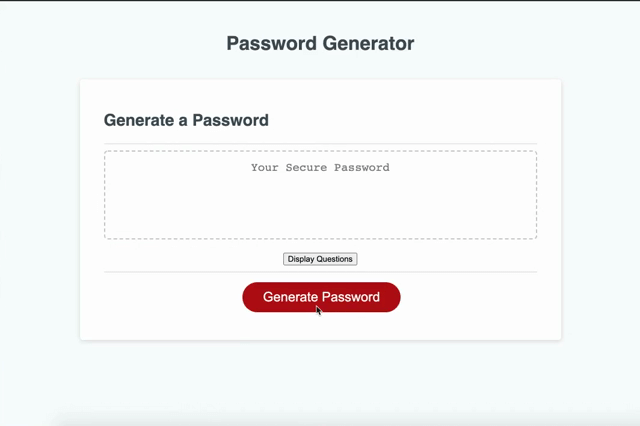

# Password Generator

## Summary

The application will randomly generate a password based on your input.

## How To Use

The website has two different ways to create a random password.

1. Click on the Generate password. You will be propmted to answer a series question about what you want in you password. Once, all of the questions are answered, a password will be generated.

2. Click on the Display Questions button. A slidebar and checkbox will be shown, you are required to check at leats on checkbox. When you are satisfied with the password requirements, clike the generate password button to create a password.

## Demo

### Technology Used:

- HTML
- CSS
- JavaScript

### Links

Deployed URL: https://kpegeder.github.io/password-generator/

GitHub Repository URL: https://github.com/kpegeder/password-generator

### Lincense - Mit
